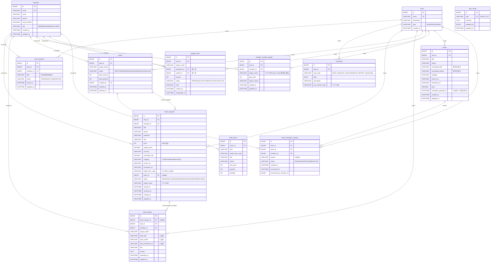

# ERD — 테이블 구조

현재 JPA 엔티티 기반으로 생성되는 모든 테이블의 ERD.
**모든 관계는 "논리적 FK" (실제 DB FK 제약 없음, `Long` 컬럼으로만 연결)** — 도메인 간 결합도 최소화 + 모듈 확장 용이성을 위한 선택.

## 도메인 그룹

| 도메인 | 테이블 | 비고 |
|---|---|---|
| 공통 | `app_config` | 화이트리스트 등 런타임 설정 |
| 사용자 | `members` | 앱 전역 회원 |
| 클럽 | `clubs`, `club_members`, `schedules` | 동호회 공통 |
| 무제 (독서 플러그인) | `book_requests`, `book_reports`, `orders`, `order_items`, `books`, `book_exemption_request` | 책 신청·합산 주문·독후감·카탈로그·제한풀기 |
| 예산 | `member_monthly_budget`, `budget_share` | 월별 한도 + 유저 간 나눔 |

---

## Mermaid ER 다이어그램

---

## 테이블 상세

### `members` — 앱 전역 회원
| 컬럼 | 타입 | 제약 | 설명 |
|---|---|---|---|
| `id` | BIGINT | PK | IDENTITY |
| `email` | VARCHAR | NOT NULL, UNIQUE | 로그인 키 |
| `name` | VARCHAR | NOT NULL | |
| `picture` | VARCHAR | | Google OAuth 프로필 사진 |
| `email_verified` | BOOLEAN | NOT NULL | 이메일 Verify Code 통과 여부 |
| `role` | VARCHAR(50) | NOT NULL | `MEMBER` / `ADMIN` / `DEVELOPER` — 환경변수 이메일 화이트리스트로 자동 결정 |
| `created_at` | DATETIME | NOT NULL | `@CreatedDate` |
| `updated_at` | DATETIME | | `@LastModifiedDate` |

### `clubs` — 동호회
| 컬럼 | 타입 | 제약 | 설명 |
|---|---|---|---|
| `id` | BIGINT | PK | |
| `name` | VARCHAR | NOT NULL, UNIQUE | "무제", "(향후 추가)" |
| `description` | VARCHAR | NOT NULL | |
| `type` | VARCHAR(30) | NOT NULL | `READING` / `GENERAL` — 플러그인 라우팅 키 |
| `created_at` | DATETIME | NOT NULL | |

### `club_members` — 클럽 가입 상태
| 컬럼 | 타입 | 제약 | 설명 |
|---|---|---|---|
| `id` | BIGINT | PK | |
| `club_id` | BIGINT | NOT NULL | `clubs.id` 논리 FK |
| `member_id` | BIGINT | NOT NULL | `members.id` 논리 FK |
| `role` | VARCHAR(30) | NOT NULL | `ADMIN` / `MEMBER` — 동호회 단위 역할 |
| `status` | VARCHAR(30) | NOT NULL | `PENDING` / `ACTIVE` / `REJECTED` |
| `joined_at` | DATETIME | NOT NULL | |
| `updated_at` | DATETIME | | |
| **UK** | | `(club_id, member_id)` | 회원당 클럽 1 row |

### `schedules` — 클럽 일정
| 컬럼 | 타입 | 제약 | 설명 |
|---|---|---|---|
| `id` | BIGINT | PK | |
| `club_id` | BIGINT | NOT NULL | |
| `type_code` | VARCHAR(50) | NOT NULL | 플러그인별 `typeCode` (e.g. `BOOK_REQUEST_DEADLINE`) |
| `date` | DATE | NOT NULL | |
| `description` | VARCHAR(200) | | |
| `year_month_value` | VARCHAR(7) | NOT NULL | `YYYY-MM` (date 에서 파생, 쿼리 인덱스용) |

### `book_requests` — 책 신청 (무제)
| 컬럼 | 타입 | 제약 | 설명 |
|---|---|---|---|
| `id` | BIGINT | PK | |
| `club_id` | BIGINT | NOT NULL | |
| `member_id` | BIGINT | NOT NULL | 신청자 |
| `title` / `author` / `publisher` / `isbn` | | | 도서 스냅샷 |
| `price` | INT | NOT NULL | **KRW 환산가** (`original_price * exchange_rate`) |
| `original_price` | DECIMAL(12,2) | | 원가 |
| `currency` | VARCHAR(5) | NOT NULL | `KRW`, `USD`, `JPY` 등 |
| `exchange_rate` | DECIMAL(12,4) | | 국내서 1.0 |
| `category` | VARCHAR(30) | NOT NULL | `LITERATURE` / `HUMANITIES` / `SELF_DEVELOPMENT` / `ARTS` / `IT` / `COMICS` / `ECONOMY` / `LIFESTYLE` / `SCIENCE` / `ETC` |
| `source_url` | VARCHAR(500) | NOT NULL | 알라딘 상품 URL |
| `thumbnail_url` | VARCHAR(500) | | |
| `aladin_item_code` | VARCHAR(20) | | K-CODE — 카트 자동 담기 스크립트용, nullable |
| `order_id` | BIGINT | | `orders.id`, 합산 주문에 묶이면 세팅 |
| `status` | VARCHAR(30) | NOT NULL | `PENDING`→`LOCKED`→`ORDERED`→`SHIPPING`→`ARRIVED`→`RECEIVED` |
| `target_month` | VARCHAR(7) | NOT NULL | `YYYY-MM` |
| `arrived_at` / `received_at` | DATETIME | | 상태 전이 타임스탬프 |
| `created_at` / `updated_at` | DATETIME | | |
| **IDX** | | `(member_id, target_month)`, `(club_id, target_month)` | |

### `book_reports` — 독후감 (무제)
| 컬럼 | 타입 | 제약 | 설명 |
|---|---|---|---|
| `id` | BIGINT | PK | |
| `book_request_id` | BIGINT | | `book_requests.id` — 신청 도서에서 작성 시 백링크 (nullable, 다른 책으로 작성 가능) |
| `club_id`, `member_id`, `target_month` | | NOT NULL | |
| `book_title` / `book_author` / `book_thumbnail_url` | | | **도서 정보 스냅샷** (BookRequest 수정에 영향받지 않음) |
| `title`, `content` | | NOT NULL | 독후감 제목 / TEXT 본문 |
| `submitted_at`, `updated_at` | DATETIME | | |
| **UK** | | `(club_id, member_id, target_month)` | 월당 1편 |
| **IDX** | | `(member_id, target_month)`, `(club_id, target_month)` | |

### `orders` — 합산 주문서 (무제)
| 컬럼 | 타입 | 제약 | 설명 |
|---|---|---|---|
| `id` | BIGINT | PK | |
| `club_id`, `target_month` | | NOT NULL | |
| `status` | VARCHAR(30) | NOT NULL | `DRAFT` / `ORDERED` / `SHIPPING` / `ARRIVED` / `CANCELLED` |
| `total_amount` / `total_quantity` | INT | NOT NULL | BookRequest ORDERED 전이 시 자동 누적 |
| `created_by` | BIGINT | NOT NULL | 관리자 |
| `created_at`, `ordered_at` | DATETIME | | |
| **IDX** | | `(club_id, target_month)` | |

### `order_items` — 주문서 라인 아이템
| 컬럼 | 타입 | 제약 | 설명 |
|---|---|---|---|
| `id` | BIGINT | PK | |
| `order_id` | BIGINT | NOT NULL | `orders.id` |
| `isbn`, `aladin_item_code` | | | |
| `title`, `author` | | | |
| `unit_price`, `quantity`, `subtotal` | INT | NOT NULL | 같은 ISBN 중복 신청 시 quantity ↑↓ |
| **IDX** | | `order_id` | |

### `member_monthly_budget` — 멤버 월별 예산 스냅샷
| 컬럼 | 타입 | 제약 | 설명 |
|---|---|---|---|
| `id` | BIGINT | PK | |
| `club_id`, `member_id` | | NOT NULL | |
| `target_month` | VARCHAR(7) | NOT NULL | **컬럼명은 `target_month`** — MySQL `YEAR_MONTH` 예약어 회피. JPA 필드명은 `yearMonth` |
| `base_limit` | INT | NOT NULL | 정책 계산값 스냅샷 (과거 월 불변) |
| `adjust_reason` | VARCHAR(200) | | 관리자 조정 사유 |
| `created_at`, `updated_at` | DATETIME | | |
| **UK** | | `(club_id, member_id, target_month)` | |
| **IDX** | | `(club_id, target_month)` | |

### `budget_share` — 유저 간 예산 나눔
| 컬럼 | 타입 | 제약 | 설명 |
|---|---|---|---|
| `id` | BIGINT | PK | |
| `club_id`, `target_month` | | NOT NULL | |
| `requester_id` | BIGINT | NOT NULL | 받는 쪽 (신청자) |
| `sender_id` | BIGINT | NOT NULL | 주는 쪽 (양도자) |
| `amount` | INT | NOT NULL | 양의 정수 |
| `status` | VARCHAR(20) | NOT NULL | `PENDING` → `{ACCEPTED, REJECTED, CANCELLED}` (ACCEPTED 불변) |
| `note` | VARCHAR(200) | | |
| `created_at`, `responded_at` | DATETIME | | |
| **IDX** | | `(club_id, target_month, requester_id)`, `(club_id, target_month, sender_id)`, `(status)` | |

### `books` — 클럽 보유 책 카탈로그 (무제)
| 컬럼 | 타입 | 제약 | 설명 |
|---|---|---|---|
| `id` | BIGINT | PK | |
| `club_id` | BIGINT | NOT NULL | `clubs.id` 논리 FK |
| `title` | VARCHAR(300) | NOT NULL | 원본 제목 |
| `author` | VARCHAR(200) | | 원본 저자 |
| `normalized_title` | VARCHAR(300) | NOT NULL | 중복 판정 키 (NFKC + 공백 collapse + lowercase) |
| `normalized_author` | VARCHAR(200) | NOT NULL | 중복 판정 키 |
| `category` | VARCHAR(30) | | `BookCategory` enum |
| `source_url` | VARCHAR(500) | | 알라딘 상품 URL |
| `thumbnail_url` | VARCHAR(500) | | |
| `price` | DECIMAL(12,2) | | |
| `exemption_granted_at` | DATETIME | nullable | set 되면 중복 체크 대상에서 영구 제외 |
| `created_at`, `updated_at` | DATETIME | | |
| **UK** | | `(club_id, normalized_title, normalized_author)` — `uk_books_club_title_author` | 클럽별 중복 방지 |

### `book_exemption_request` — 제한풀기(중복 허용) 신청
| 컬럼 | 타입 | 제약 | 설명 |
|---|---|---|---|
| `id` | BIGINT | PK | |
| `club_id`, `book_id`, `member_id` | BIGINT | NOT NULL | 논리 FK |
| `reason` | VARCHAR(500) | nullable | 신청 사유 |
| `status` | VARCHAR(20) | NOT NULL | `PENDING` → `{APPROVED, REJECTED}` |
| `created_at`, `processed_at` | DATETIME | | |
| `processed_by_member_id` | BIGINT | | 승인/거절 처리자 |
| **IDX** | | `idx_ber_club_status (club_id, status)`, `idx_ber_book (book_id)` | |
| 규칙 | | `(club_id, book_id, status=PENDING)` 동시에 1건만 | 재신청은 REJECTED 된 이후만 가능 |

### `app_config` — 전역 설정 (DEVELOPER 전용)
| 컬럼 | 타입 | 제약 | 설명 |
|---|---|---|---|
| `id` | BIGINT | PK | |
| `type` | VARCHAR(50) | NOT NULL, UNIQUE | enum `ConfigType` — 현재 `WHITE_LIST` 하나 |
| `contents` | TEXT | NOT NULL | 설정 값 (현재 스키마는 free-form TEXT) |
| `updated_by` | BIGINT | | `members.id` |
| `updated_at` | DATETIME | | `@UpdateTimestamp` |

---

## 설계 특징

- **FK 제약 없음**: 모든 `*_id` 컬럼은 `Long` + 논리 참조. 모듈/플러그인이 추가·제거될 때 DDL 마이그레이션 부담 제거.
- **월별 스냅샷**: `target_month: VARCHAR(7)` (YYYY-MM) 로 파티션. 정책 변경이 과거 데이터에 영향 주지 않도록 가격·예산 모두 신청/스냅샷 시점 값을 박아둠.
- **상태 머신 일원화**: 책 신청·주문·나눔 모두 `VARCHAR + @Enumerated(EnumType.STRING)` — 엔티티 메서드(`accept()`, `markArrived()` 등)에서만 전이 허용.
- **도서 정보 스냅샷**: `book_reports.book_title/author/thumbnail_url` 는 `book_requests` 를 따라가지 않고 작성 시점에 복사 → 관리자가 신청 책 정보를 수정해도 독후감이 영향받지 않음.
- **예약어 회피**: `member_monthly_budget.target_month` — 애초에 `year_month` 로 짰다가 MySQL interval unit reserved keyword 에 걸려 DDL 이 깨졌음.
